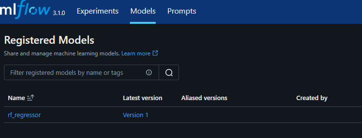

# MLflow Quick Start avec Poetry

*Par Arthur Cartel Foahom Gouabou*\
[cartelgouabou.github.io](https://cartelgouabou.github.io/)  •  [LinkedIn](https://www.linkedin.com/in/arthur-cartel-foahom-gouabou-phd-41041195/)

Ce tutoriel vous montre comment **tracker, versionner et recharger un modèle de machine learning** avec **MLflow**, dans un projet Python structuré avec **Poetry**.

Nous allons créer un projet simple, avec deux scripts clairs :

- `train_and_register.py` : entraînement et enregistrement du modèle
- `load_and_predict.py` : rechargement et inférence

---

## Objectif

Vous apprendrez à :

- Créer un projet propre avec Poetry
- Utiliser **MLflow** pour :
  - suivre les paramètres et métriques
  - sauvegarder des artefacts (graphiques, modèles)
  - enregistrer un modèle dans le **Model Registry**
  - recharger un modèle versionné pour une inférence future

---

## 1. Initialiser le projet avec Poetry

Dans un terminal, exécutez les commandes suivantes :

```bash
poetry new mlflow_quickstart
cd mlflow_quickstart
poetry config virtualenvs.in-project true
poetry install
poetry add mlflow scikit-learn matplotlib pandas
```

> - Création du projet 
> - Installation des bibliothèques nécessaires.
> - Environnement virtuel créé dans le dossier `.venv` local.

💡 **Astuce :** Si vous souhaitez configurer **Poetry** pour fonctionner de manière fluide avec **VS Code** (détection automatique de l’environnement virtuel, autocomplétion, etc.), j’ai rédigé un tutoriel dédié à ce sujet.  
👉 [Voir le guide de configuration Poetry + VS Code](https://github.com/cartelgouabou/Full_stacks_ai_course/blob/main/tools/data_science_toolkit/poetry_vscode_setup.md)

---

## 2. Lancer l'interface web de MLflow

```bash
poetry run mlflow ui
```
> - Cette commande lance l’interface web de MLflow en local, à partir de l’environnement virtuel géré par Poetry.
> - Elle permet de visualiser les expériences, paramètres, métriques, artefacts et modèles enregistrés.


> Interface web MLflow après lancement local

---

## 3. Script d'entraînement : `train_and_register.py`

### Exécuter le script

```bash
poetry run python src/mlflow_quickstart/train_and_register.py
```

> Exécution du script dans le terminal

### Étape 1 : Chargement des données

```python
from sklearn.datasets import load_diabetes
from sklearn.model_selection import train_test_split

X, y = load_diabetes(return_X_y=True)
X_train, X_test, y_train, y_test = train_test_split(X, y)
```

---

### Étape 2 : Configuration de MLflow

```python
import mlflow
mlflow.set_tracking_uri("http://localhost:5000")
mlflow.set_experiment("mlflow_quickstart")
```

> - Cette configuration connecte votre script à une instance MLflow locale disponible à l’adresse `http://localhost:5000`.
> - En entreprise ou en environnement cloud, cette URI pourrait pointer vers un serveur distant, par exemple `https://mlflow.my-company-name.aws-region.amazonaws.com` ou une URL fournie par votre équipe DevOps. Il suffit de remplacer l'URI par celle du serveur MLflow utilisé dans votre infrastructure.
> - `set_experiment()` permet de regrouper vos expériences sous un même nom logique (ici : `mlflow_quickstart`).
---

### Étape 3 : Entraînement et suivi du modèle

```python
from sklearn.ensemble import RandomForestRegressor
from sklearn.metrics import root_mean_squared_error

with mlflow.start_run(run_name="RandomForest_baseline") as run:
    model = RandomForestRegressor(n_estimators=100, max_depth=5)
    model.fit(X_train, y_train)
    predictions = model.predict(X_test)
    rmse = root_mean_squared_error(y_test, predictions)

    mlflow.log_param("n_estimators", 100)
    mlflow.log_param("max_depth", 5)
    mlflow.log_metric("rmse", rmse)
```

> - with mlflow.start_run(run_name="RandomForest_baseline"): Lance un nouveau run (session d’expérimentation) avec un nom explicite. Tout ce qui est loggué à l’intérieur sera lié à cette exécution.
> - mlflow.log_param(...): Enregistre des hyperparamètres pour chaque run. Cela facilite la comparaison entre différentes configurations.
> - mlflow.log_metric(...): Enregistre des métriques de performance. Ici, on suit la RMSE (erreur quadratique moyenne racine) pour évaluer le modèle.


> Affichage du run nommé `RandomForest_baseline` dans l'expérience `mlflow_quickstart`
---

### Étape 4 : Logguer un artefact visuel

```python
import matplotlib.pyplot as plt
import os

os.makedirs("artefacts", exist_ok=True)
fig_path = "artefacts/scatter.png"
plt.figure()
plt.scatter(y_test, predictions)
plt.xlabel("True Values")
plt.ylabel("Predictions")
plt.title("True vs Predicted")
plt.savefig(fig_path)
plt.close()

mlflow.log_artifact(fig_path)
```

> - mlflow.log_artifact(fig_path) enregistre le fichier image comme artefact dans MLflow. C’est utile pour suivre l’évolution de la qualité du modèle avec différents paramètres ou versions.


> L'artefact visuel est accessible dans l'onglet `Artifacts`
---

### Étape 5 : Enregistrement du modèle dans le Model Registry

```python
import pandas as pd
from mlflow.models import infer_signature

input_example = pd.DataFrame(X_test[:2], columns=[f"feature_{i}" for i in range(X_test.shape[1])])
signature = infer_signature(X_test, predictions)

mlflow.sklearn.log_model(
    sk_model=model,
    name="model_diabetes",
    input_example=input_example,
    signature=signature,
    registered_model_name="rf_regressor"
)
```

> - Ce bloc de code enregistre le modèle entraîné de manière complète et reproductible :
> - input_example permet de montrer à quoi doivent ressembler les données d’entrée au moment du déploiement.
> - signature enregistre la structure des entrées/sorties du modèle.
> - registered_model_name permet d’ajouter automatiquement le modèle au Model Registry, sous le nom rf_regressor.
> - Ce format facilite le partage, le déploiement (API, batch) et la comparaison entre différentes versions du > même modèle. Il fonctionne également avec d'autres frameworks (TensorFlow, PyTorch, XGBoost, etc.) en adaptant mlflow.<framework>.log_model().


> Le modèle rf_regressor est bien enregistré dans le Model Registry, version 1
---

## 4. Script de prédiction : `load_and_predict.py`

### Exécuter le script

```bash
poetry run python src/mlflow_quickstart/load_and_predict.py
```

### Étape 1 : Chargement du modèle enregistré

```python
from mlflow.pyfunc import load_model
import mlflow

mlflow.set_tracking_uri("http://localhost:5000")
model_uri = "models:/rf_regressor/1"
loaded_model = load_model(model_uri)
```
> - Connexion à MLflow
> - load_model(model_uri) recharge un modèle précédemment enregistré dans le Model Registry de MLflow (ici, la version 1 du modèle >"rf_regressor"), quelle que soit sa technologie (scikit-learn, XGBoost, etc.).

### Étape 2 : Prédiction sur de nouvelles données

```python
from sklearn.datasets import load_diabetes

X, y = load_diabetes(return_X_y=True)
predictions = loaded_model.predict(X[:5])
print("Predictions on first 5 samples:", predictions)
```


> Le modèle `rf_regressor` `version 1` a bel et bien pu être rechargé depuis `mlflow registry` pour effectuer la prédiction
---

## Structure du projet

```
mlflow_quickstart/
├── pyproject.toml
├── poetry.lock
├── artefacts/                 # Généré lors de l'exécution
├── src/
│   └── mlflow_quickstart/
│       ├── train_and_register.py
│       └── load_and_predict.py
```

---

## Commandes utiles

| Action                    | Commande                                                        |
| ------------------------- | --------------------------------------------------------------- |
| Créer le projet           | `poetry new mlflow_quickstart --src`                            |
| Activer l'environnement   | `poetry install`                                                  |
| Installer les dépendances | `poetry add mlflow scikit-learn matplotlib pandas`              |
| Lancer l'UI MLflow        | `poetry run mlflow ui`                                          |
| Exécuter l'entraînement   | `poetry run python src/mlflow_quickstart/train_and_register.py` |
| Faire une prédiction      | `poetry run python src/mlflow_quickstart/load_and_predict.py`   |

---

Document rédigé par Arthur Cartel Foahom Gouabou  — Formateur & Data Scientist •  [https://cartelgouabou.github.io/](https://cartelgouabou.github.io/) •  [LinkedIn](https://www.linkedin.com/in/arthur-cartel-foahom-gouabou-phd-41041195/)

