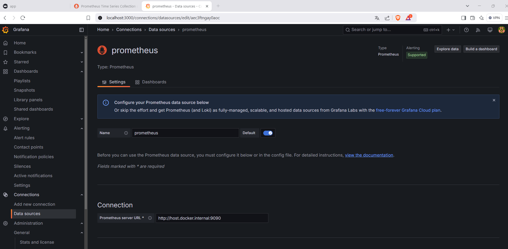

# 📅 **Step-by-Step Guide: Monitoring ML Model Performance with Prometheus & Grafana**

In this tutorial, we'll walk you through deploying a simple **sentiment analysis app** using **Streamlit** and setting up **Prometheus** and **Grafana** to monitor the model's performance in real time. By the end, you'll be able to track key metrics like **model accuracy**, and **number of requests**.

---

## 📊 **Prerequisites**

1. **Python 3.7+** installed
2. **Docker** installed (for running Prometheus and Grafana)
   - Install Docker by following the official guide: [https://www.docker.com/get-started/](https://www.docker.com/get-started/)
   - 🔹 *Highly recommended:* After installing Docker, add the **Docker extension** in **VS Code** for easier container management.
3. Basic understanding of Python and machine learning Basic understanding of Python and machine learning

---

## 📂 **GitHub Repository Structure**

```
prometheus-grafana-mlops
├── app
│   ├── app.py               # Streamlit app UI logic
│   └── model.py             # Sentiment analysis model and prediction logic
├── monitoring
│   ├── prometheus.yml           # Prometheus configuration file
│   ├── Dockerfile.prometheus    # Dockerfile to build Prometheus
│   └── Dockerfile.grafana       # Dockerfile to build Grafana
├── tuto-assets
│   ├── step1_running_app/png    # Screenshot to ease the application of the tutorial
│   ├── ...
│   └── ...
├── .gitignore               # Files/folders to ignore in Git
└── README.md                # This guide
```

---

## 🔧 **Step 1: Clone the Repository & Install Dependencies**
Let’s start by cloning the repository and setting up your environment.
1. **Clone the Repository Using Sparse Checkout:**
This method will download only the relevant project files from the larger repository.

   ```bash
   # 1. Clone the repository in sparse-checkout mode
    git clone --no-checkout https://github.com/cartelgouabou/Full_stacks_ai_course.git
    cd Full_stacks_ai_course

   # 2. Initialize sparse-checkout and set the target folder
    git sparse-checkout init --cone
    git sparse-checkout set tools/data_science_toolkit/prometheus-grafana-ml
    git checkout main

    # 3. Move the project folder and clean up
    mv tools/data_science_toolkit/prometheus-grafana-ml ../prometheus-grafana-ml
    cd ..
    rm -r Full_stacks_ai_course # Run as administrator if needed

    # 4. Navigate to the project directory
    cd prometheus-grafana-ml
   ```

2. **Set Up a Virtual Environment and Install Dependencies:**

   ```bash
   python -m venv venv_tuto
   source venv_tuto/bin/activate  # On Windows use `.\venv_tuto\Scripts\activate`
   pip install streamlit plotly prometheus-client transformers torch
   ```

---

## 🌐 **Step 2: Run the Streamlit App**
Let’s launch the Streamlit app and verify that it’s exposing the necessary metrics.
1. **Start the Streamlit app:**

   ```bash
   streamlit run app/app.py
   ```

2. **Check if the app is running:**

   Open your browser and go to **`http://localhost:8501`**.
   

3. **Verify Prometheus metrics are exposed:**

   Visit **`http://localhost:8001/metrics`** to see the metrics exposed by the app:
   

---

## 🎓 **Step 3: Understand Key Parts of the App (Prometheus Integration)**

Here’s a quick overview of how Prometheus metrics are integrated into the Streamlit app.

### **1. Starting Prometheus Metrics Server:**
This exposes an HTTP endpoint for Prometheus to scrape metrics from.
```python
from prometheus_client import start_http_server
start_http_server(8001)  # Metrics available at http://localhost:8001/metrics
```

### **2. Defining Metrics:**

We define counters and gauges to track the number of requests and model accuracy.

```python
from prometheus_client import Gauge, Counter

# Tracks the total number of prediction requests
request_count_metric = Counter("ml_model_requests_total", "Total number of prediction requests")

# Tracks user-reported model accuracy
accuracy_metric = Gauge("ml_model_accuracy", "User-reported model accuracy")
```

### **3. Updating Metrics in the App:**

Metrics are updated based on user interactions in the Streamlit app.

```python
if st.button("Analyze Sentiment"):
    request_count_metric.inc()  # Increment request count
    label, confidence = predict_sentiment(user_input)

# Update accuracy based on user feedback
if feedback == "Yes":
    accuracy_metric.set(new_accuracy_value)
```

---

## 🔧 **Step 4: Configure Prometheus**

Prometheus needs to know where to scrape the metrics from.

1. **Open `prometheus.yml` and ensure it looks like this:**

   ```yaml
   global:
     scrape_interval: 5s  # Scrape every 5 seconds

   scrape_configs:
     - job_name: 'ml_model'
       static_configs:
         - targets: ['host.docker.internal:8001']  # For Windows/macOS
         # For Linux, use: ['localhost:8001']
   ```
Explanation:

- `scrape_interval: 5s`: Prometheus will scrape metrics from the app every 5 seconds.
- `targets:`
- - `host.docker.internal:8001` is used for Docker-to-host communication on Windows/macOS.
- - On Linux, Docker can directly communicate with `localhost:8001`

2. **Build and Run the Prometheus Container:**

Ensure **Docker** is running before proceeding with `docker --version`.

**a. Build the Docker image:**
   ```bash
   docker build -t custom-prometheus -f monitoring/Dockerfile.prometheus .
   ```

   **b. Run the Prometheus container:**
   ```bash
   docker run -d --name=prometheus -p 9090:9090 custom-prometheus
   ```


3. **Verify Prometheus is Running and Scraping Metrics:**

   - Go to **`http://localhost:9090`**
   - Click **Status → Targets**
   - Ensure **`http://localhost:8001/metrics`** is listed and **UP**.


4. **Query metrics in Prometheus:**

   - Enter `ml_model_accuracy` in the search bar and click **Execute**.

   

---

## 📈 **Step 5: Configure Grafana**

Grafana helps visualize the metrics collected by Prometheus.

1. **Build and Run the Grafana Container:**
   
   **a. Build the Docker image:**
   ```bash
   docker build -t custom-grafana -f monitoring/Dockerfile.grafana .
   ```

   **b. Run the Grafana container:**
   ```bash
   docker run -d --name=grafana -p 3000:3000 custom-grafana
   ```

2. **Access Grafana:**
   Open **`http://localhost:3000`**.

3. **Login to Grafana:**

   - **Username:** `admin`
   - **Password:** `admin`


4. **Add Prometheus as a Data Source:**

   - Go to **Connections → Data Sources → Add Data Source**
   - Choose **Prometheus**
   - Set URL to **`http://host.docker.internal:9090`** (or `http://localhost:9090` on Linux)
   - Click **Save & Test**


---

## 📊 **Step 6: Create Dashboards in Grafana**

### **1. Create a New Dashboard:**

- Go to **Dashboard → Create dashboard → Add visualization**
- Choose **prometheus source**

### **2. Add Queries for Metrics:**

- **Model Accuracy Trend:**

  ```promql
  ml_model_accuracy
  ```

- **Total Requests:**

  ```promql
  ml_model_requests_total
  ```

### **3. Customize Visualization:**

- Choose between **line charts**, **gauge**, or **bar charts**.
- Set **refresh rate** to **5s** for real-time updates.

### **4. Save the Dashboard:**

- Click **Save** and name your dashboard **"Monitoring model accuracy"**.


---

## 📢 **Step 7: Set Alerts in Grafana**

1. **Go to your dashboard panel and click "Edit".**
2. Navigate to the **"Alert"** tab and set conditions like:
   - **If model accuracy falls below 80% for 5 minutes:**
     ```promql
     ml_model_accuracy < 0.8
     ```
   - **If inference latency exceeds 2 seconds:**
     ```promql
     ml_model_latency_seconds > 2
    ```


3. **Configure notifications** (Slack, email, etc.) using **Alertmanager**.

---


## 🌟 **Conclusion**

You’ve now set up a complete **ML model monitoring pipeline** using **Prometheus** and **Grafana**. This setup can be easily extended to track more complex models and integrate with **CI/CD** pipelines for **automated deployments and monitoring**.

**Happy Monitoring!** 

